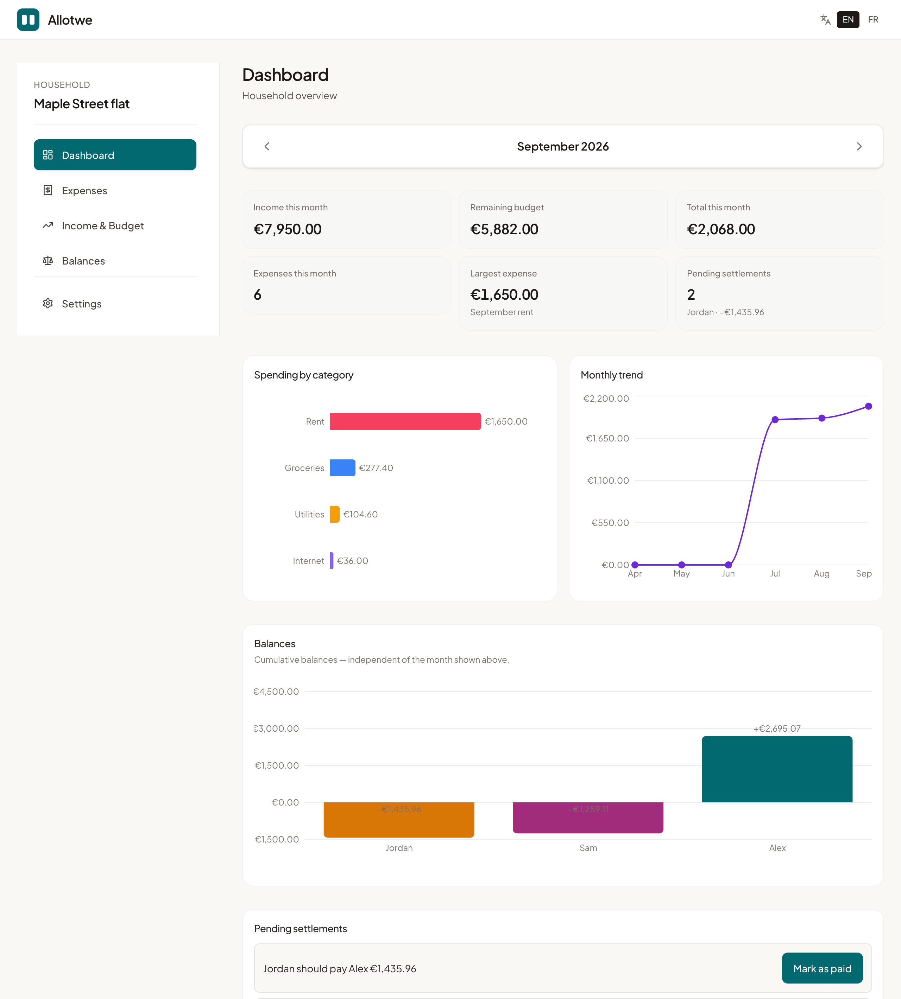

# Allotwe (Foyer Manager)

**See who paid, and who owes what.** Shared household expenses for couples, roommates, or one person.
Open source, self-hostable, no ads.

[Try it on allotwe.com](https://allotwe.com) · [Self-host it](#self-hosting) · [Report a bug](https://github.com/Mikawx3/foyer-manager/issues)

[](LICENSE)




## Why

Tricount and Splitwise are great, but your household finances live on someone else's servers.
Allotwe gives you the same clarity: one balance per person, recurring bills already split. You can
use the hosted version or run your own copy.

## Features

| | |
|---|---|
| **Clear balances** | Who advanced money, who owes whom, and what is left to settle. |
| **Flexible splits** | Equal shares, percentages, or default rules per category. |
| **Recurring bills** | Rent, internet, electricity: set once, generated every period. |
| **Settlements** | Record reimbursements; balances update instantly. |
| **Income and budget** | Monthly income, savings rate, what is left to spend. |
| **Invitations** | Share a household by link. Invitees can join as a guest or with an account. |
| **Solo mode** | Track your own spending with no one to invite. |
| **Privacy first** | No ads, no data resale, Google sign-in optional. English and French. |

## Self-hosting

Requirements: Docker with Docker Compose.

```bash
git clone https://github.com/Mikawx3/foyer-manager.git
cd foyer-manager
cp .env.example .env
# Fill in POSTGRES_PASSWORD and JWT_SECRET (openssl rand -base64 48)
docker compose up -d
```

Open http://localhost:8080. Database migrations run automatically when the API starts.

- **Public access**: put a TLS reverse proxy (Caddy, Traefik, nginx) in front of the `web` service.
- **Google sign-in**: set `GOOGLE_CLIENT_ID` and add your domain to the OAuth client's authorized origins.
- **Updates**: `git pull && docker compose up -d --build`.
- **Backups**: the database lives in the `db-data` volume, for example
  `docker compose exec db pg_dump -U foyer foyer > backup.sql`.

## Tech stack

React 18, TypeScript, Vite, Tailwind v4, TanStack Query on the web; Node.js, Hono, Prisma and
PostgreSQL on the API. Monorepo with npm workspaces:

```
apps/web        React frontend
apps/api        Hono API (routes → controllers → services → repositories)
packages/types  Shared TypeScript types
```

## Development

Prerequisites: Node.js 22+, PostgreSQL running locally, and a database user with `CREATEDB`
(for the Prisma shadow database during migrations).

Development uses **two separate PostgreSQL databases** so local and cloud modes do not share data.

| Mode | Env file | Database | Start command |
|------|----------|----------|---------------|
| Local (no auth) | `apps/api/.env.local` | `foyer_local` | `npm run dev:local` |
| Cloud (JWT auth) | `apps/api/.env.development` | `foyer_dev` | `npm run dev:cloud` |

```bash
createdb foyer_local
createdb foyer_dev
cp apps/api/.env.local.example apps/api/.env.local
cp apps/api/.env.development.example apps/api/.env.development
npm install
npm run db:migrate:local -w @foyer/api
npm run db:migrate:dev -w @foyer/api
npm run dev            # defaults to local mode
```

Reset one database without affecting the other:

```bash
npm run db:reset:local -w @foyer/api   # foyer_local only
npm run db:reset:dev -w @foyer/api     # foyer_dev only
```

> Never point a development env file at the production database: `prisma migrate dev` and
> `db:reset` can wipe it.

| Command | Description |
|---------|-------------|
| `npm run dev` / `npm run dev:local` | Web + API in local deployment mode |
| `npm run dev:cloud` | Web + API in cloud deployment mode |
| `npm run build` | Build all workspaces |
| `npm run test` | Run all tests |

See [apps/api/README.md](apps/api/README.md) for API details and [NETWORK.md](NETWORK.md) for LAN access.

### Growth stats

Set `ADMIN_STATS_TOKEN` (32+ characters) on the API, then:

```bash
curl -H "Authorization: Bearer $ADMIN_STATS_TOKEN" "https://your-domain/api/admin/stats?days=30"
```

It returns accounts, guests, households, activation and a daily breakdown. The API also logs one
JSON line per product event (`"kind":"product_event"`), with no personal data. Opening the
registration page logs `signup_started`.

## Contributing

Issues and pull requests are welcome. Read [CONTRIBUTING.md](CONTRIBUTING.md) first. For security
issues, see [SECURITY.md](SECURITY.md).

## License

[GNU AGPL-3.0](LICENSE). You can use, modify and self-host it freely. If you run a modified version
for other people, you must publish your changes under the same license.
